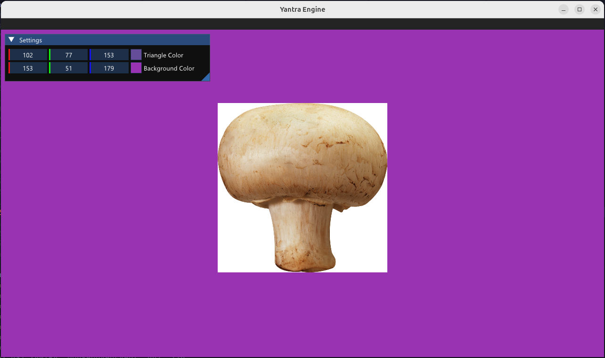
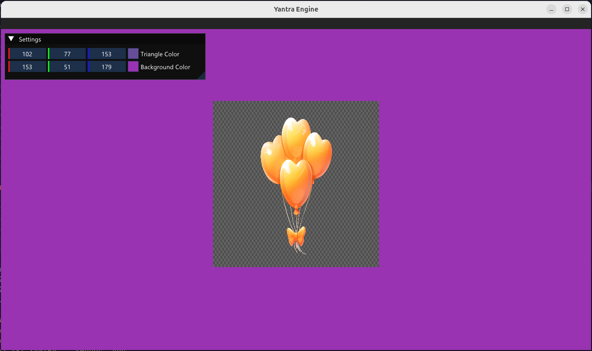
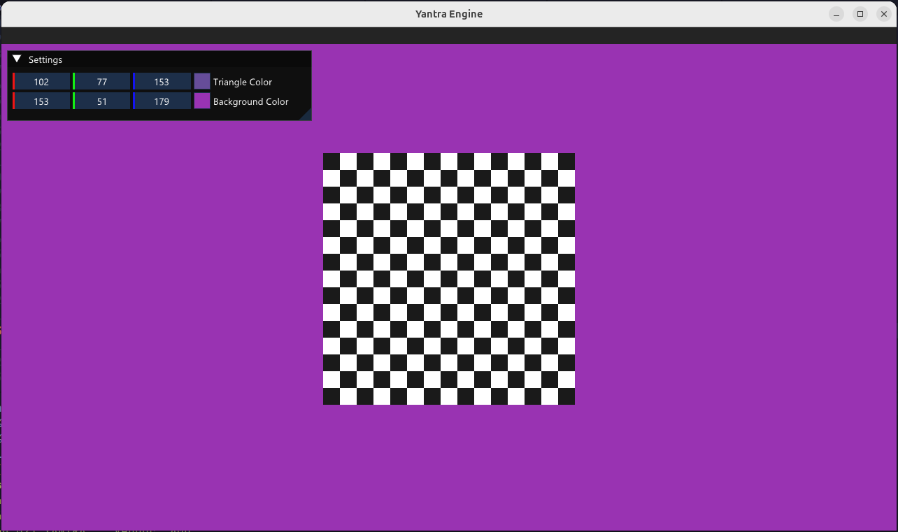

# Yantra Engine



**Yantra** is a 2D Game Engine written in C++ using modern OpenGL. It is designed as a high-performance, modular system to understand the core architecture of game development tools, from memory management to rendering pipelines.

> **Status:** Active Development (Pre-Alpha)  
> **Target Platform:** Linux (Primary), Windows (Planned)

## Features

Currently, the engine supports the following systems:

* **Core Architecture**
    * **Layer Stack System:** Modular application updates (similar to Unity/Unreal component updates).
    * **Event System:** Blocking event propagation for Window, Mouse, and Keyboard events.
    * **Logging:** High-speed console logging via `spdlog`.
* **Rendering (OpenGL 4.5+)**
    * **Abstraction Layer:** API-agnostic classes for Buffers, Vertex Arrays, and Shaders.
    * **Orthographic Camera:** Adjustable zoom, rotation, and position for 2D worlds.
    * **Texture System:** Support for `.png`, `.jpg` (via `stb_image`) with Alpha Blending.
    * **ImGui Integration:** Fully functional debug layers and docking support.
* **Platform**
    * **Input Polling:** Real-time keyboard and mouse state queries.
    * **Windowing:** Custom GLFW window implementation with VSync control.

## Gallery

| Renderer Test | ImGui Integration |
|:---:|:---:|
|  |  |
| *Current State: Rendering textured quads with transparency* | *Debug overlay using ImGui* |

## Tech Stack

* **Language:** C++17
* **Graphics API:** OpenGL 4.6 (Core Profile)
* **Build System:** CMake
* **Windowing:** GLFW
* **Loader:** GLAD
* **GUI:** Dear ImGui
* **Math:** GLM
* **Logging:** spdlog
* **Asset Loading:** stb_image

## Getting Started

### Prerequisites (Linux)
Ensure you have the necessary build tools and OpenGL libraries installed.

```bash
# Ubuntu / Debian
sudo apt-get install build-essential git cmake libgl1-mesa-dev libxi-dev libcursor-dev

# 1. Clone the repository recursively
git clone --recursive https://github.com/Anurag-Bhatt/Yantra
# 2. Navigate to the folder
cd Yantra

# 3. Create a build directory
mkdir build && cd build

# 4. Generate Makefiles and Build
cmake ..
make

# 5. Run the Sandbox
./bin/Yantra-Sandbox

### **Part 5: Roadmap & File Structure**
This outlines your Game Jam plan and the folder layout.

```markdown
## Roadmap (Feb 2026 Game Jam)

- [x] **Phase 1: Foundation** (Windowing, Events, Basic Rendering)
- [x] **Phase 2: Textures** (Image Loading, Alpha Blending, Shader Uniforms)
- [ ] **Phase 3: Batch Rendering** (Rendering 10,000+ sprites in one draw call)
- [ ] **Phase 4: 2D Physics** (Box2D Integration)
- [ ] **Phase 5: Gameplay Systems** (Scene management, Scripting)

## Project Structure

```text
Yantra/
├── Yantra-Core/       # The Engine Library (src/Yantra)
│   ├── src/
│   │   ├── Platform/  # OpenGL & Linux specific implementations
│   │   └── Yantra/    # Renderer, Events, Layers (API Independent)
│   └── vendor/        # Third-party libraries (GLM, ImGui, spdlog)
├── Yantra-Sandbox/    # The "Game" built on top of the engine
└── assets/            # Textures, Shaders, and resources
